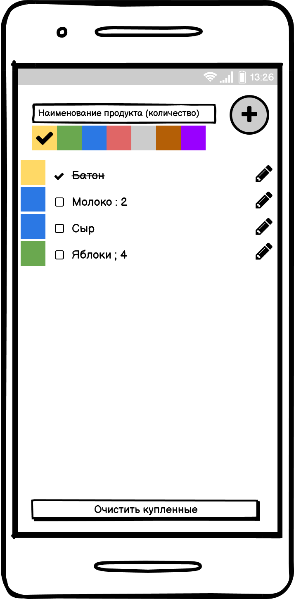

# Задание №1 - Список покупок

С помощью Xamarin.Forms создать приложение-список покупок, похожее на [Купи батон](https://play.google.com/store/apps/details?id=com.buymeapie.bmap)

Функционал:
- добавление элементов в список покупок (при добавлении можно указывать кол-во через двоеточие и цвет (группу) продукта)
- в списке покупок кол-во показываем только если кол-во больше 1го
- редактирование элемента (изменение наименование, группы и кол-ва)
- удаление элемента из списка покупок
- отметка о покупке с помощью галочки
- удаление всех купленных элементов одной кнопкой

Тех. требования:
- архитектура mvvm

